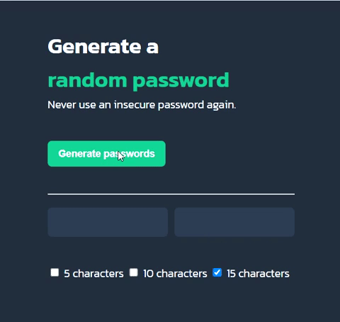

# Password-generator

JavaScript challenge from Scrimba

HTML, CSS and JS done from scratch following pre-designed UI from Figma as a reference for CSS. 

Next challange will be to add the option if the user would like to generate a password only with digits, letters or special characters, or combined. 

